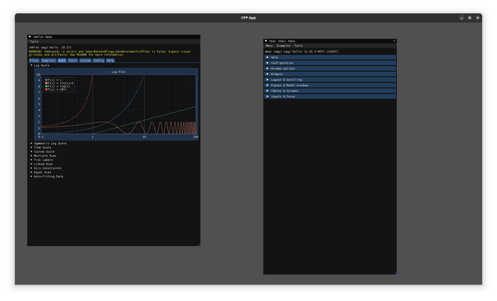

# CPP ImGui Starter.
This project provides a simple jumping off point for writing ImGui apps with C++.
Window management is provided by Raylib, which compiles out of the box on most systems.


## Usage
Checkout the repsitory, making sure to properly initialise the submodules.
```
https://github.com/rfletchr/cpp_imgui_starter_app.git my_app
cd my_app
git submodule init
git submodule update --recursive
cmake --preset debug
cmake --build --preset debug
```

## Missing Dependencies
In cases where configuration fails due to missing dependencies Raylib provides a guide [here](https://github.com/raysan5/raylib/wiki/raylib-dependencies#platform-specific-dependency-notes).

## CMAKE / Ninja
make sure that both cmake and ninja are installed.


### Building
The project is configured using CMAKE see `CMakePresets.json`

To build the debug build run the following.
```
cmake --preset debug
cmake --build --preset debug
build/debug/cpp_app
```


